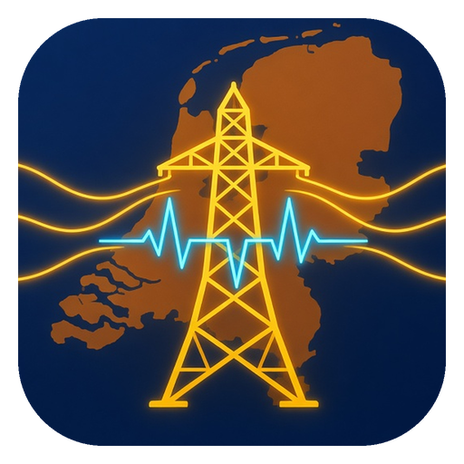

# NL Grid Watch

**Dutch grid-stress forecast for Home Assistant — backfeed risk when the sun is up, evening-peak risk when it is not.**

## Features

- Postcode → local overload forecast (same idea as a weather forecast, not a fuse-blow promise)
- **Backfeed risk** when teruglevering is already tight and the next midday is clear
- **Evening-peak risk** when afname is tight and the coming evening is dark/cold (16:00–21:00)
- Capaciteitskaart colours from Netbeheer Nederland / TenneT (ArcGIS)
- Open-Meteo irradiance, cloud cover and temperature
- Optional [energieonderbrekingen.nl](https://energieonderbrekingen.nl/api/v2/) interruptions (OAuth client credentials)
- Persisted last-good snapshot so a bad poll does not blank your sensors
- Dutch + English UI translations
- Ready-made stress notification blueprint

> This is **not** a cable-fault predictor. High risk means afternoons or evenings like this are when areas like yours get inverter trips or local overload — not that your house goes dark at 16:40.

## Install (HACS custom repository)

1. HACS → Integrations → ⋮ → **Custom repositories**
2. URL: `https://github.com/DonTranQuiL/NL-Grid-Watch-For-Home-assistant`
3. Category: **Integration**
4. Download **NL Grid Watch**, then restart Home Assistant
5. Settings → Devices & services → Add Integration → **NL Grid Watch** → enter your postcode

Leave the energieonderbrekingen fields empty unless you already have a client id and secret. The forecast does not need them.

Manual install: copy `custom_components/nl_grid_watch` into `/config/custom_components/` and restart.

## Options

| Option | Default | Notes |
|--------|---------|-------|
| `scan_interval` | 30 min | 15–180 |
| `client_id` / `client_secret` | empty | Optional energieonderbrekingen OAuth |

## Entities

| Entity | Role |
|--------|------|
| `sensor.*_afname` | Afname status: `available` / `limited` / `investigation` / `queue` |
| `sensor.*_teruglevering` | Teruglevering status (same scale) |
| `sensor.*_backfeed_risk` | `none` / `low` / `high` (+ window attrs) |
| `sensor.*_evening_peak_risk` | `none` / `low` / `high` (+ window attrs) |
| `binary_sensor.*_stress_expected` | On when either risk is high (`active_window` attr) |
| `sensor.*_interruption` | `not_configured` until EO token is set; then `none` / `planned` / `active` / `error` |
| Diagnostic update sensors | Consecutive errors / last status / last time |

Service: `nl_grid_watch.refresh`

Blueprint: `blueprints/automation/grid_stress_notify.yaml`

## Data sources

- **PDOK Locatieserver** — postcode → coordinate
- **Netbeheer Nederland capaciteitskaart** (ArcGIS) — weekly area colour for afname and teruglevering
- **Open-Meteo** — hourly irradiance, cloud, temperature
- **Optional:** energieonderbrekingen.nl API v2 (Enexis, Liander, Stedin)

The capaciteitskaart is about connections above 3×80A. It does not see your street cabinet.

## Docs

Project docs: [dontranquil.github.io/NL-Grid-Watch-For-Home-assistant](https://dontranquil.github.io/NL-Grid-Watch-For-Home-assistant/)

## Disclaimer

Unofficial. Not affiliated with Netbeheer Nederland, TenneT, energieonderbrekingen.nl, Enexis, Liander or Stedin. Forecasts can be wrong or delayed — always verify with your grid operator before relying on them.

## Support

- Issues: [GitHub Issues](https://github.com/DonTranQuiL/NL-Grid-Watch-For-Home-assistant/issues)
- Community: [Discord](https://discord.gg/qaHPTTKHae)
- Tip jar: [Ko-fi](https://ko-fi.com/DonTranQuiL)

## License

MIT — see [LICENSE](LICENSE).
