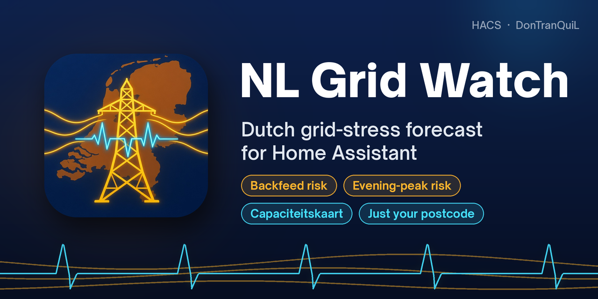

<div align="center">



<br>

**A weather forecast for the Dutch power grid at your postcode: backfeed risk while the sun is up, evening-peak risk once it goes down.**

[](https://my.home-assistant.io/redirect/hacs_repository/?owner=DonTranQuiL&repository=NL-Grid-Watch-For-Home-assistant&category=integration)

[](https://github.com/DonTranQuiL/NL-Grid-Watch-For-Home-assistant/releases)
[](https://hacs.xyz)
[](https://www.home-assistant.io/)
[](LICENSE)
[](https://github.com/DonTranQuiL/NL-Grid-Watch-For-Home-assistant/releases)

[](https://github.com/DonTranQuiL/NL-Grid-Watch-For-Home-assistant/actions/workflows/pytest.yml)
[](https://github.com/DonTranQuiL/NL-Grid-Watch-For-Home-assistant/actions/workflows/hass-ci.yml)
[](https://github.com/DonTranQuiL/NL-Grid-Watch-For-Home-assistant/actions/workflows/hassfest.yaml)
[](https://github.com/DonTranQuiL/NL-Grid-Watch-For-Home-assistant/actions/workflows/hacs.yaml)
[](https://github.com/DonTranQuiL/NL-Grid-Watch-For-Home-assistant/actions/workflows/codeql.yml)
[](https://github.com/astral-sh/ruff)
[](https://discord.gg/qaHPTTKHae)
[](https://ko-fi.com/DonTranQuiL)

[Install](#installation) · [Entities](#entities) · [How it works](#how-the-forecast-works) · [Dashboard](#dashboard-example) · [Automations](#automation-examples) · [Docs site](https://dontranquil.github.io/NL-Grid-Watch-For-Home-assistant/)

</div>

## Highlights

| | |
| --- | --- |
| ☀️ **Backfeed risk** | Warns when teruglevering in your area is already tight and the next midday (10:00–16:00) looks clear and sunny. That is when inverters trip. |
| 🌙 **Evening-peak risk** | Warns when afname is tight and the coming evening (16:00–22:00) is dark, cloudy or cold. |
| 🗺️ **Official capacity map** | Uses the Netbeheer Nederland *capaciteitskaart* colours for afname and teruglevering, plus the grid operator, supply area and queue. |
| 📮 **Just your postcode** | No account, no API key. PDOK turns your postcode into a location. |
| ⚡ **Optional interruptions** | Planned and active outages from energieonderbrekingen.nl, if you have client credentials. |
| 🛟 **Keeps working** | The last good snapshot is saved, so a failed poll doesn't blank your sensors. Diagnostic sensors show poll health. |
| 🔔 **Ready-made blueprint** | A one-click notification when grid stress is expected. |
| 🇳🇱 **Dutch and English** | The UI is translated into both. |

> [!NOTE]
> This is **not** a cable-fault predictor. *High* means that afternoons or evenings like this are when areas like yours see inverter trips or local overload. It does not mean your house will go dark at 16:40.

## Installation

### HACS (recommended)

Click the **Open in HACS** button above, or add the repository yourself:

1. HACS → ⋮ → **Custom repositories**
2. URL: `https://github.com/DonTranQuiL/NL-Grid-Watch-For-Home-assistant`, category **Integration**
3. Download **NL Grid Watch**, then restart Home Assistant

### Manual

Copy `custom_components/nl_grid_watch` to `/config/custom_components/` and restart Home Assistant.

## Configuration

[](https://my.home-assistant.io/redirect/config_flow_start/?domain=nl_grid_watch)

**Settings → Devices & services → Add integration → NL Grid Watch**, then enter your postcode (`1012AB`, `1012 ab` or just `1012`). Add one entry per postcode you want to watch.

| Field | Default | Notes |
| --- | --- | --- |
| Postcode | — | Required. Spaces and case don't matter. |
| `client_id` / `client_secret` | empty | Optional energieonderbrekingen.nl OAuth credentials. The forecast works without them. |
| Scan interval (options) | 30 min | 15–180 minutes. Change it under **Configure**. |

## Entities

Each postcode gets one device, **NL Grid Watch &lt;postcode&gt;**. The example IDs below are for postcode `1012AB`.

| Entity | State | Useful attributes |
| --- | --- | --- |
| `sensor.nl_grid_watch_1012ab_afname_status` | `available` · `limited` · `investigation` · `queue` | `operator`, `area`, `queue_mw`, `requests`, `place` |
| `sensor.nl_grid_watch_1012ab_teruglevering_status` | same scale | same as above |
| `sensor.nl_grid_watch_1012ab_backfeed_risk` | `none` · `low` · `high` | `window` (start, end, hours, peak_radiation, min_temperature) |
| `sensor.nl_grid_watch_1012ab_evening_peak_risk` | `none` · `low` · `high` | `window` |
| `binary_sensor.nl_grid_watch_1012ab_stress_expected` | `on` when either risk is `high` | `active_window` (`backfeed` / `evening_peak` / `none`), both risks and windows |
| `sensor.nl_grid_watch_1012ab_interruption` | `not_configured` · `none` · `planned` · `active` · `error` | `count`, `items` (first 5) |
| Diagnostic: consecutive errors, last update status, last update time | poll health | — |

**Service:** `nl_grid_watch.refresh` fetches the capacity map, weather and interruptions now, for every entry.

## How the forecast works

| Capacity status (capaciteitskaart) | Weather in the window | Risk |
| --- | --- | --- |
| Teruglevering is `investigation` or `queue` | Midday radiation ≥ 500 W/m² and clouds ≤ 40% | Backfeed **high** |
| Teruglevering is `limited` or worse | Midday radiation ≥ 300 W/m² | Backfeed **low** |
| Afname is `investigation` or `queue` | Evening clouds ≥ 70%, ≤ 8 °C, or November–February | Evening peak **high** |
| Afname is `limited` | same | Evening peak **low** |

Windows use the Open-Meteo hourly forecast for today and tomorrow. The capacity map covers connections above 3×80 A, so it describes your area, not your street cabinet.

## Dashboard example

Uses only built-in cards:

```yaml
type: vertical-stack
cards:
  - type: conditional
    conditions:
      - condition: state
        entity: binary_sensor.nl_grid_watch_1012ab_stress_expected
        state: "on"
    card:
      type: markdown
      content: >-
        ⚡ **Grid stress expected**:
        {{ state_attr('binary_sensor.nl_grid_watch_1012ab_stress_expected', 'active_window') | replace('_', ' ') }}
  - type: glance
    title: NL Grid Watch
    entities:
      - entity: sensor.nl_grid_watch_1012ab_backfeed_risk
        name: Backfeed
      - entity: sensor.nl_grid_watch_1012ab_evening_peak_risk
        name: Evening peak
      - entity: sensor.nl_grid_watch_1012ab_afname_status
        name: Afname
      - entity: sensor.nl_grid_watch_1012ab_teruglevering_status
        name: Teruglevering
  - type: entities
    entities:
      - entity: binary_sensor.nl_grid_watch_1012ab_stress_expected
      - entity: sensor.nl_grid_watch_1012ab_interruption
```

## Automation examples

**One-click blueprint.** It notifies you when `stress_expected` turns on:

[](https://my.home-assistant.io/redirect/blueprint_import/?blueprint_url=https://github.com/DonTranQuiL/NL-Grid-Watch-For-Home-assistant/blob/main/blueprints/automation/grid_stress_notify.yaml)

**Hold off the dishwasher or EV charging during an evening peak:**

```yaml
automation:
  - alias: "Grid: pause EV charging on evening peak"
    triggers:
      - trigger: state
        entity_id: sensor.nl_grid_watch_1012ab_evening_peak_risk
        to: "high"
    actions:
      - action: switch.turn_off
        target:
          entity_id: switch.ev_charger
      - action: notify.mobile_app_phone
        data:
          message: >-
            Evening peak expected
            {{ state_attr('sensor.nl_grid_watch_1012ab_evening_peak_risk', 'window').start }}
            → {{ state_attr('sensor.nl_grid_watch_1012ab_evening_peak_risk', 'window').end }}.
            EV charging paused.
```

**Use your own solar power at midday when backfeed is likely:**

```yaml
automation:
  - alias: "Grid: soak up solar on backfeed risk"
    triggers:
      - trigger: state
        entity_id: sensor.nl_grid_watch_1012ab_backfeed_risk
        to: "high"
    conditions:
      - condition: time
        after: "10:00:00"
        before: "16:00:00"
    actions:
      - action: switch.turn_on
        target:
          entity_id: switch.boiler
```

## Data sources

- **[PDOK Locatieserver](https://api.pdok.nl/bzk/locatieserver/search/v3_1/ui/)**: postcode → coordinate
- **[Netbeheer Nederland capaciteitskaart](https://capaciteitskaart.netbeheernederland.nl/)** (ArcGIS): area status for afname and teruglevering
- **[Open-Meteo](https://open-meteo.com/)**: hourly irradiance, cloud cover and temperature
- **Optional: [energieonderbrekingen.nl](https://energieonderbrekingen.nl/)** API v2 (Enexis, Liander, Stedin)

A daily [feed watcher](.github/workflows/ai-feed-watcher.yml) checks these sources for breaking changes and opens an issue when a field the integration needs disappears.

## Troubleshooting

| Problem | Fix |
| --- | --- |
| *Invalid postcode* | Use a Dutch postcode: 4 digits, optionally followed by 2 letters. |
| Afname/teruglevering shows `unknown` | The capacity map has no supply area at that point. Try a nearby postcode. |
| Risk is always `none` | That's good news: your area isn't tight, or the weather doesn't match. Check the status sensors. |
| Interruption is `error` | Check the client id and secret under **Configure**. The forecast keeps working either way. |
| Sensors not updating | Check the diagnostic sensors (consecutive errors, last update status), then call `nl_grid_watch.refresh`. |

For debug logs, add this to `configuration.yaml`:

```yaml
logger:
  logs:
    custom_components.nl_grid_watch: debug
```

## Credits

- Capacity data © Netbeheer Nederland and the Dutch grid operators
- Geocoding by PDOK (Kadaster), weather by [Open-Meteo](https://open-meteo.com/) (CC BY 4.0)
- Built and maintained by [DonTranQuiL](https://github.com/DonTranQuiL)

## Disclaimer

Unofficial. Not affiliated with Netbeheer Nederland, TenneT, energieonderbrekingen.nl, Enexis, Liander or Stedin. Forecasts can be wrong or late, so check with your grid operator before relying on them.

## Support

- Docs: [dontranquil.github.io/NL-Grid-Watch-For-Home-assistant](https://dontranquil.github.io/NL-Grid-Watch-For-Home-assistant/)
- Issues: [GitHub Issues](https://github.com/DonTranQuiL/NL-Grid-Watch-For-Home-assistant/issues)
- Community: [Discord](https://discord.gg/qaHPTTKHae)
- Tip jar: [Ko-fi](https://ko-fi.com/DonTranQuiL)

## License

MIT, see [LICENSE](LICENSE).
